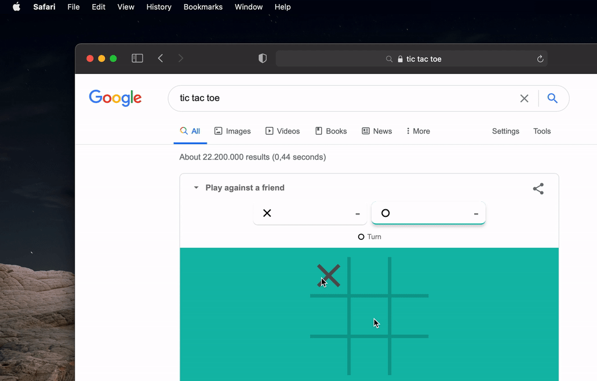

# mouseplague

mouseplague gives every mouse connected to your mac its own screen cursor.

### How to run

* Build and run the project from within Xcode.
* Give mouseplague the "Input Monitoring" and "Accessibility" permissions.

### Compatibility

The code has been tested to work for macOS 11.1 Big Sur.

### Limitations

* Dragging and mouse-over functionality only works with the first mouse connected.
* MacBooks trackpads do not offer haptic feedback if they are used as a secondary mouse.
